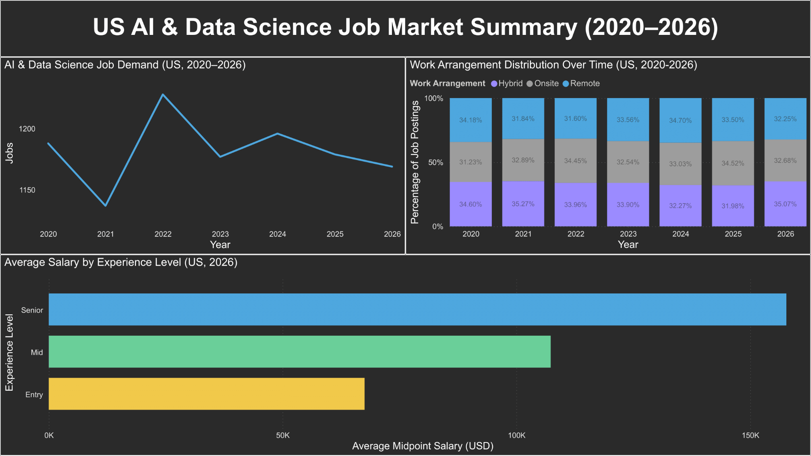

# United States AI & Data Science Job Market Trends (2020–2026)

## Overview
This project analyzes trends in the **United States AI & Data Science job market** from 2020–2026 using SQL, with a small Power BI visual summary for communication.

The objective of the project is to understand how:
- job demand has changed over time
- compensation has evolved
- work arrangements (remote, hybrid, onsite) are distributed
- experience level and industry influence outcomes

The project emphasizes **SQL-first analysis** and **clear analytical reasoning**, with Power BI used strictly for visualization of finalized results.

---

## Dataset
The dataset contains approximately **50,000 AI & Data Science job postings** across multiple countries and years (2020–2026).

Each record includes:
- job title  
- company type and size  
- industry  
- country and city  
- work arrangement (remote, hybrid, onsite)  
- experience level  
- salary range (minimum and maximum, USD)  
- year posted  

To avoid global averaging effects and better reflect realistic market behavior, this analysis focuses exclusively on **US-based job postings** (`country = 'USA'`).

> **Note:** The raw dataset and database files are not included in this repository. See `.gitignore` for details.

---

## Tools
- SQL (SQLite)
- DB Browser for SQLite
- Power BI (visualization only)

---

## Project Structure

```text
us-ai-data-science-job-market-sql/
├── README.md
├── .gitignore
├── sql/
│   ├── 00_schema_and_sanity_checks.sql
│   ├── 01_clean_view.sql
│   ├── 01a_clean_view_us.sql
│   ├── 02_demand_over_time.sql
│   ├── 03_salary_trends.sql
│   ├── 04_remote_work_trends.sql
│   ├── 05_salary_by_experience.sql
│   ├── 06_remote_by_experience.sql
│   └── 07_industry_snapshot_latest_year.sql
└── visuals/
    └── dashboard_summary.png
```

---

## Setup (SQLite)
To reproduce the analysis:

1. Create a new SQLite database (e.g. `ai_jobs.db`) using DB Browser for SQLite.
2. Import the CSV file as a table named `ai_jobs`.
3. Run the SQL scripts in order, starting with `sql/00_schema_and_sanity_checks.sql`.

---

## Data Preparation
A clean analytical view (`ai_jobs_clean`) is created to prepare the data without modifying the raw table. This view:

- standardizes text fields using `TRIM()`
- preserves all numeric fields
- derives a midpoint salary metric (`salary_mid_usd`) using float-safe division

A second view (`ai_jobs_us`) filters the clean data to **US-only postings**, ensuring all analysis uses a consistent geographic scope.

---

## Analysis Summary

### 1. Job Demand Over Time
**Question:** How many AI & Data Science jobs were posted each year in the US?

**Approach:**  
Job postings were grouped by year and counted to observe changes in demand.

**Insight:**  
US job demand remains relatively stable from 2020–2026, with modest year-to-year fluctuations rather than sustained growth or decline. This suggests a mature labor market with consistent hiring needs.

---

### 2. Salary Trends Over Time
**Question:** How have salaries changed over time in the US?

**Approach:**  
Average minimum, midpoint, and maximum salaries were calculated per year using postings with complete salary information.

**Insight:**  
Average salaries increased gradually through 2023–2024, followed by a mild dip in 2025 and partial recovery in 2026. Overall changes are incremental, indicating normalization rather than long-term salary contraction.

---

### 3. Work Arrangement Trends
**Question:** How are jobs distributed across remote, hybrid, and onsite work over time?

**Approach:**  
Yearly percentages were calculated for each work arrangement.

**Insight:**  
Hybrid roles consistently represent the largest share of postings across all years. Remote and onsite roles fluctuate modestly, suggesting hybrid work has become the dominant long-term equilibrium.

---

### 4. Salary Differences by Experience Level
**Question:** How does experience level affect compensation?

**Approach:**  
Average midpoint salaries were compared across experience levels.

**Insight:**  
Experience level is the strongest driver of salary outcomes. While year-to-year changes are modest, the gap between entry-, mid-, and senior-level roles is large and consistent.

---

### 5. Remote Work by Experience Level
**Question:** Are senior roles more likely to be remote?

**Approach:**  
For the most recent year, the distribution of work arrangements was analyzed within each experience level.

**Insight:**  
Senior roles show a higher share of remote opportunities, while entry-level roles skew more onsite, likely reflecting differences in autonomy and training requirements.

---

### 6. Industry Snapshot (Latest Year)
**Question:** Which industries offer the highest typical salaries?

**Approach:**  
Average midpoint salaries were calculated by industry for the most recent year, applying a minimum sample size threshold.

**Insight:**  
Salary differences across industries are relatively modest, while job volume varies more substantially. Industry choice affects opportunity availability more than compensation at the aggregate level.

---

## Key Takeaways
- The US AI & Data Science job market shows **stable demand** rather than boom–bust cycles.
- **Experience level** explains salary differences more strongly than time or industry.
- **Hybrid work** has emerged as the dominant work arrangement.
- Industry influences where jobs are concentrated more than how much they pay.

Overall, the analysis demonstrates how structural factors often matter more than short-term trends when interpreting labor market data.

---

## Visual Summary (Power BI)

The following visual summary was created in Power BI using the final outputs of the SQL analysis.



---

## Notes
- All data preparation and aggregation logic is implemented in SQL.
- Power BI is used strictly for visualization to avoid duplicating business logic.
- The project prioritizes clarity, reproducibility, and analytical judgment over dashboard complexity.
